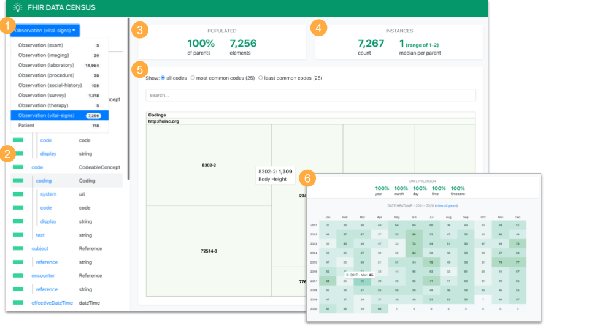

# Data Census Toolkit

|Note: The Data Census Toolkit is early stage software - code is rough, there are bugs and features may change or be removed. If you come across any issues, please consider contributing to the project by submitting an issue or pull request.| 
|:-|

## Overview

The Data Census Toolkit is a utility for **data engineers**, **researchers**, and **developers** to characterize [FHIR](https://hl7.org/fhir) datasets prior to activities like analyzing the data, loading it into a native FHIR data store, or converting it to another data format such as OMOP.

For example, a data set may be reviewed to:
- Perform a sanity check for expected fields and time periods
- Understand variation in FHIR Elements (fields) and Resources (collections of fields) within and between data sources (e.g., data coming from different EHR systems)
- Determine if desired data is present (e.g., a particular lab test or vital sign)

Information from these reviews can then be used to:
- Develop and maintain data cleaning scripts in an ETL or data conversion pipeline
- Provide feedback to EHR Vendors, Healthcare Providers, and Payors to improve datasets

## Demo

- [Launch the Exploration Application with Sample Data](http://syncfor.science/data-census/index.html?data=summary.json)

## Components
1. **Census Builder** - Command line data summarization utility. Generates aggregate FHIR metrics from one or more [FHIR Bulk Export](https://hl7.org/fhir/uv/bulkdata/index.html) files in [ndjson](http://ndjson.org/) format and/or [FHIR Bundle](https://www.hl7.org/fhir/bundle.html) files in [JSON](https://www.hl7.org/fhir/json.html) format and output these metrics to a summary file.

2. **Census Explorer** - Web based application to read in a summary file generated by Census Builder and enable users to review the data:
	- Visualize prevalence of FHIR data elements and types
	- Navigate and search populated terminology systems and codes
	- Understand the data's temporal distribution and date precision
	- Guide the activities needed to transform data for analysis

## Setup

1. Install prerequisites
	- [Git](https://git-scm.com/downloads)
	- [NodeJs](https://nodejs.org)

2. Clone this repository
	```
	git clone [github path]/data-census
	```

3. Install dependencies
	```
	cd data-census/builder
	npm i
	cd ../explorer
	npm i
	```

4. When generating a census, you'll need to point the summarization utility to a set of FHIR definitions for the FHIR version of the data you're working with. Download the JSON version of the FHIR definitions for the latest version from https://www.hl7.org/fhir/downloads.html and unzip the file to a local directory. You can find definitions for other versions of FHIR by navigating from http://hl7.org/fhir/directory.html.

## Census Builder

The Census Builder generates aggregate FHIR metrics from one or more [FHIR Bulk Export](https://hl7.org/fhir/uv/bulkdata/index.html) files in [ndjson](http://ndjson.org/) format and/or [FHIR Bundle](https://www.hl7.org/fhir/bundle.html) files in [json](https://www.hl7.org/fhir/json.html) format and outputs them to a summary file.

To run the Builder, make sure you're in the `/data-census/builder` directory and execute the following command, replacing `[data-directory]` with the path to one or more ndjson FHIR Bulk Export files or json FHIR Bundles and replacing `[fhir-definition-directory]` with the path to the FHIR definition files downloaded in step 3 of the setup section above. By default, a file named `summary.json` will be generated in the current working directory with summary metrics for your data set. Details and additional optional command line parameters are listed below. Note the `--` that is required between the npm command and the command arguments.

```
npm run build -- -r [data-directory] -p [fhir-definition-directory]
```

| Parameter | Short | Cardinality | Description |
| - | -| - | - |
| resources | r | 0..* | Path to a directory of FHIR resource files or a single FHIR resource file. File(s) may be FHIR Bundles in json format or FHIR Bulk Data files in ndjson format. Bulk ndjson files may optionally be gzipped. Defaults to current directory. |
| profiles | p | 0..* | Path to FHIR profiles (`profiles-resources.json` and `profiles-types.json`). Census will attempt to impute some field types if this parameter is omitted. |
| output | o | 0..1 | Output folder path (file will be created as `summary.json`) or path to a specific file name with a `.json` extension. Defaults to current directory. | 
| stratify-by | s | 0..* | Stratification functions. Defaults to `obs_cat` to stratify Observation resources by category (pass a value of `none` to skip all stratification). See details below. |
| append | a | 0..1 | Flag to indicate Census should append new data to an existing output file rather than replacing it. File path and name can be set using the `output` parameter.|
| pretty | | 0..1 | Flag to indicate Census should format the output file with white space (useful for debugging). |
| skip | | 0..* | Flag to indicate element detail that should not be recorded in output file and will then not be visible in the Explorer interface. Reduces the summarization time and output file size. See details below. |


**stratify-by options:**

| Value | Description |
| - | - |
| obs_cat | Stratify resources by the category code in Observation resources. Non-Observation resources will not be stratified. |
| ehr | Stratify resources if the Meta.source extension contains a URL with the word Epic or Cerner. Other data sources can be added by adjusting `/builder/src/stratifications.js`. Future releases may support the use of a configuration files to modify this stratifications (as well as build additional stratification rules). |

Multiple stratification functions may be included in a single command (space delimited) and additional functions can be added to `builder/src/stratifications.js` and then referenced in the parameter. Note that the stratification options may change in a future version of Census.

**skip options:**

| Value | Description |
| - | - |
| coding | Prevalence tree map detail for `Coding`, `code`, `Quantity`, and `Identifier` FHIR types. |
| date | Date precision and timeline heat map detail for `date`, `dateTime`, `instant`, and `Period` FHIR types. | 
| address | Postal code detail for `Address` FHIR type. | 
| reference | Resource target detail for `Reference` FHIR type. |

Multiple data types may be skipped by including them in a single command (space delimited).

## Census Explorer

Web application that reads in a summary file generated by Census Builder and enables users to visualize and review the data.

To launch, make sure you've navigated to the `/data-census/explorer` directory and run `npm start`. You can also use an [online version](http://syncfor.science/data-census/index.html) - all data remains within your web browser instance and is not transmitted to a server. 

Summary files can be loaded from within the UI or by passing in the path to a file hosted at a URL via the `data` query string parameter. Note that if the the server hosting the UI and the server hosting the summary file differ, the server hosting the summary file must support [cross origin requests](https://developer.mozilla.org/en-US/docs/Web/HTTP/CORS).

### UI Overview

[](screenshot.png)

1. **Resource List** - FHIR resource types included in the dataset. Provides a high level overview of the available data models. Listed with their name, stratification variables (when sub-types are broken out) and count. Selecting a resource type populates the Element List (2) with relevant data. 

2. **Element List** - Overview of the FHIR data elements in the dataset for the selected resource type to aid analysis and to spot potential data mapping gaps and errors. Elements are displayed in a hierarchy ordered by their position in the relevant FHIR profile's Structure Definition. In each row, the green percentage bar on left hand side indicates how often the element is populated in the data model (relative to its parent element) and the right hand side displays the element's FHIR type. When showing FHIR extension elements, the last segment of the extension URL is displayed, and hovering over it will show the full URL path. Selecting an element populates the detail panels on the right side of the screen (3, 4, 5, 6) with relevant data.

3. **Populated Panel** - Indicates how often an element is populated in the dataset at the place in the data model where this element could appear. Shows as a percentage of the count of its parent element (or the count of resources of the selected type for root level elements) and as a count.

4. **Instance Panel** - When an element can have more than one value, indicates how many values it contains. Displays the count of its values across all resources, and the per element median count, maximum count, and minimum count.

5. **Terminology Element Detail Panel** - When the selected element has a FHIR type of `Coding`, `code`, `Quantity`, or `Identifier`, displays visualizations to drill into the data values and identify patterns for use in data conversion, analysis, and error identification. 
	- Tree map chart shows relative prevalence of terminology systems and codes populated for this element in the dataset.
	- Hovering over a code in the tree map displays its count and description.
	- Typing in the search field filters the displayed terminology values using their terminology system (e.g., `LOINC`), code value, and label text. Can be used to determine if the dataset contains a specific code of interest or what system and codes are used in the dataset to identify a particular clinical concept.
	- Restricting the chart to the most common codes highlights important codes to map or support. 
	- Restricting the chart to the least common codes highlights edge cases and potential errors.

6. **Date Element Detail Panel** - When the selected element has a FHIR type of `date`, `dateTime`, or `instant`, displays visualizations covering the precision and temporal distribution of the dates in the element.
	- Diagram of which date and time components are populated in an element's values and how often (year, month, day, time, timezone), to identify the level of date precision available for analysis.
	- Heat map visualization to quickly gauge the periods included and omitted for a date element in the dataset.
